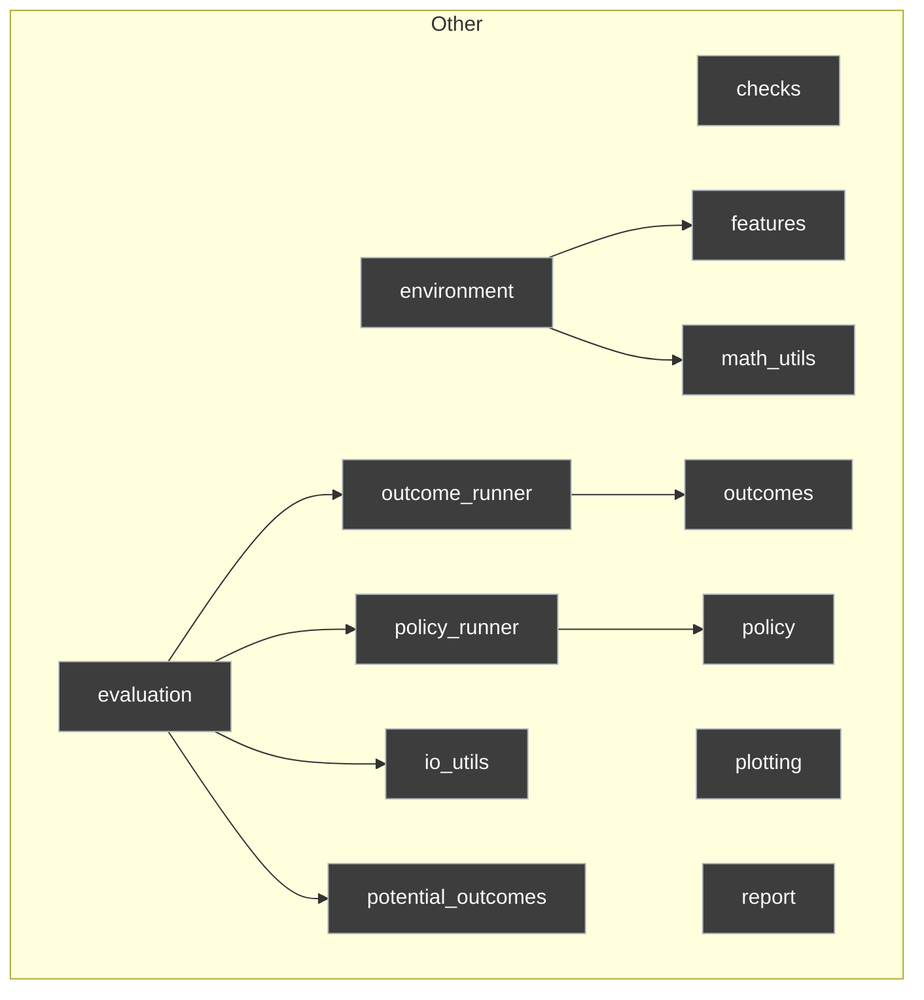

# API Documentation

## Dependency DAG

## `checks.py`

### `validate_config(config)`
validates if config is valid. keep adding validation as config grows complex.

## `level_0/features.py`

### `generate_features(config)`
generates features following specification in config

## `level_0/io_utils.py`

### `load_config(config_name, verbose)`
read config from configs folder. prints config if verbose is not False.

### `save_config(config, run_dir)`
saves this config in the run directory for results folder.

### `create_run_dir(name, author, base_dir)`
creates a directory of the form {config_name}_{author}_{timestamp} in the results folder. All artifacts from this run will be stored in this directory.

### `clear_directory(path)`
clears all run directories inside results folder. Use it before pushing to git.

### `save_df(df, name, run_dir)`

### `save_plot(fig, name, run_dir)`
Save a matplotlib Figure object to run_dir/figures as a JPG.

### `get_columns(policies)`

## `level_0/math_utils.py`

### `sigmoid(t)`
returns logistic output

### `linear_index(df, coeffs, features)`
returns the dot product of features and coefficients

## `level_0/outcomes.py`

### `realised_outcome(df, policy_col, y0_col, y1_col)`
Generate realized outcomes for a given policy.

## `level_0/plotting.py`

### `plot_policy_distribution(df_long, metric, order)`
Boxplot of policy performance with mean markers.

### `plot_policy_ecdf(df_long, metric, order)`
ECDF plot to compare distribution dominance across policies.

### `plot_feature_space(df, x_col, y_col, color_col, ax, cmap, vmin, vmax, sample_n, title)`
Scatter plot of (x_col, y_col) colored by color_col.

## `level_0/policy.py`

### `assign_policy(df, policy, K, score_col, seed)`
Assign treatment according to specified policy.

## `level_0/potential_outcomes.py`

### `draw_potential_outcomes(df, seed)`
Draw potential outcomes using a single  uniform shock.

## `level_0/report.py`

### `_load_img(path)`

### `_get_fig_paths(run_dir)`

### `_get_data_paths(run_dir)`

### `plot_feature_grid(run_map)`

### `plot_distribution_grid(run_map)`

### `plot_ecdf_grid(run_map)`

### `get_modal_winner_df(run_map)`

### `get_summary_df(run_map)`

### `generate_report(run_map)`
run_map = {

## `level_1/environment.py`

### `generate_environment(config)`
generates a dataframe containing user_id, their features, baseline and treatemnt churn indices, baseline and treatment churn probabilities, treatment effect.

## `level_1/outcome_runner.py`

### `apply_realised_outcomes(df, policy_cols, Y0_col, Y1_col)`
wrapper

## `level_1/policy_runner.py`

### `apply_policies(df, policies, seed)`
wrapper

## `level_2/evaluation.py`

### `run_simulations(df, policies, num_simulations)`

### `make_result_df(lst)`

### `get_df_long(df, id_vars, var_name, value_name)`

### `get_summary(df)`
assert df in long format

### `policy_rank_modal(df, exclude)`
tells how many times each policy wins.

API.md last updated at 2026-04-04_23-20-18.